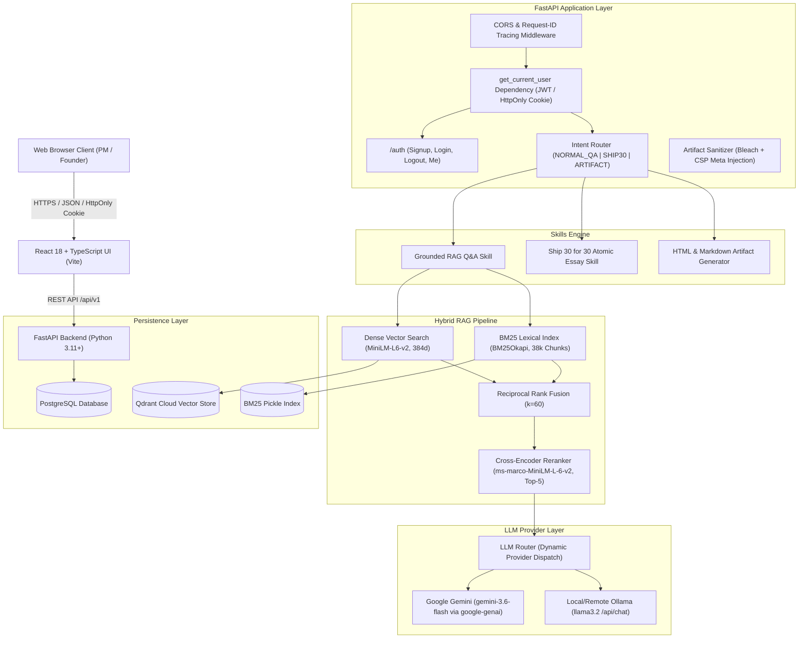

# System Architecture Specification

## Project: The Lenny Growth Assistant

---

## 1. High-Level System Topology



---

## 2. Relational Database Schema (PostgreSQL with User Ownership)

```sql
-- Users table
CREATE TABLE users (
    id CHAR(36) PRIMARY KEY,
    email VARCHAR(255) UNIQUE NOT NULL,
    password_hash VARCHAR(255) NOT NULL,
    name VARCHAR(255) NOT NULL,
    is_active BOOLEAN NOT NULL DEFAULT TRUE,
    created_at TIMESTAMP WITH TIME ZONE NOT NULL,
    updated_at TIMESTAMP WITH TIME ZONE NOT NULL,
    last_login_at TIMESTAMP WITH TIME ZONE
);
CREATE UNIQUE INDEX ix_users_email ON users(email);

-- Sessions table with User Ownership
CREATE TABLE sessions (
    id CHAR(36) PRIMARY KEY,
    user_id CHAR(36) REFERENCES users(id) ON DELETE CASCADE,
    title VARCHAR(255) NOT NULL DEFAULT 'New Conversation',
    created_at TIMESTAMP WITH TIME ZONE NOT NULL,
    updated_at TIMESTAMP WITH TIME ZONE NOT NULL,
    user_metadata JSON
);
CREATE INDEX ix_sessions_user_id ON sessions(user_id);

-- Messages table
CREATE TABLE messages (
    id CHAR(36) PRIMARY KEY,
    session_id CHAR(36) NOT NULL REFERENCES sessions(id) ON DELETE CASCADE,
    role VARCHAR(32) NOT NULL,
    content TEXT NOT NULL,
    created_at TIMESTAMP WITH TIME ZONE NOT NULL,
    model_provider VARCHAR(64),
    model_name VARCHAR(128),
    latency_ms INTEGER,
    intent_type VARCHAR(32) DEFAULT 'NORMAL_QA'
);
CREATE INDEX ix_messages_session_id ON messages(session_id);

-- Message sources (grounding citations)
CREATE TABLE message_sources (
    id CHAR(36) PRIMARY KEY,
    message_id CHAR(36) NOT NULL REFERENCES messages(id) ON DELETE CASCADE,
    chunk_id VARCHAR(128) NOT NULL,
    source_title VARCHAR(255) NOT NULL,
    source_url VARCHAR(512),
    speaker VARCHAR(128),
    source_type VARCHAR(64) DEFAULT 'podcast_transcript',
    relevance_score FLOAT,
    rank INTEGER DEFAULT 1,
    snippet TEXT NOT NULL,
    created_at TIMESTAMP WITH TIME ZONE NOT NULL
);
CREATE INDEX ix_message_sources_message_id ON message_sources(message_id);

-- Artifacts table
CREATE TABLE artifacts (
    id CHAR(36) PRIMARY KEY,
    session_id CHAR(36) NOT NULL REFERENCES sessions(id) ON DELETE CASCADE,
    message_id CHAR(36) REFERENCES messages(id) ON DELETE SET NULL,
    artifact_type VARCHAR(32) NOT NULL,
    title VARCHAR(255) NOT NULL,
    content TEXT NOT NULL,
    raw_content TEXT NOT NULL,
    created_at TIMESTAMP WITH TIME ZONE NOT NULL,
    metadata_json JSON
);
CREATE INDEX ix_artifacts_session_id ON artifacts(session_id);

-- Ingestion audit log
CREATE TABLE ingestion_runs (
    id CHAR(36) PRIMARY KEY,
    started_at TIMESTAMP WITH TIME ZONE NOT NULL,
    completed_at TIMESTAMP WITH TIME ZONE,
    status VARCHAR(32) DEFAULT 'RUNNING',
    document_count INTEGER DEFAULT 0,
    chunk_count INTEGER DEFAULT 0,
    error_summary TEXT,
    run_metadata JSON
);
```

---

## 3. Authentication & Security Architecture

1. **Password Hashing (Argon2id)**:
   - Uses `argon2-cffi` configured with 64MB memory cost, 3 time iterations, and 4 parallel threads.
   - Plaintext credentials are never logged or stored.
2. **Session Handling via HttpOnly Cookies**:
   - Authentication tokens are signed JWTs with standard expiration (`exp`) and subject (`sub`) claims.
   - Delivered exclusively via `HttpOnly; SameSite=Lax; Path=/` cookies.
   - Inaccessible to browser JavaScript (XSS-immune).
3. **Strict Data Isolation**:
   - Every session query filters by `user_id == current_user.id`.
   - Accessing another user's session returns `404 Not Found`.
